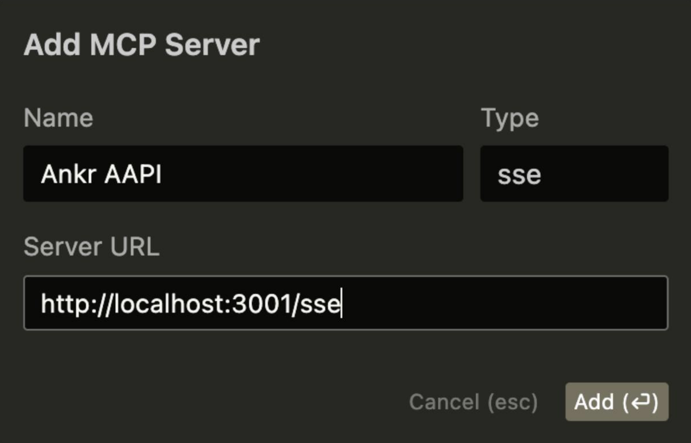

# Ankr Advanced API MCP Server ⚡

This is a Model Context Protocol ([MCP](https://modelcontextprotocol.io/)) server that provides tools for interacting with Ankr's Advanced APIs. It enables AI models to fetch blockchain data and perform various operations.

## Tools

- `getAccountBalance`: Fetch token balances across multiple blockchains for any address or ENS name
- `getTokenPrice`: Get current price for any token (native or ERC20) on supported blockchains

## Supported Blockchains

- **Mainnets:** Ethereum, BSC, Polygon, Arbitrum, Avalanche, Base, Fantom, Gnosis, Linea, Optimism, and more
- **Testnets:** Ethereum Sepolia, Ethereum Holesky, Base Sepolia, Avalanche Fuji, and others

## Prerequisites

1. [Ankr Advanced API Endpoint](http://ankr.com/rpc/)
   - Create a free account at [ankr.com/rpc](http://ankr.com/rpc/)

## Local development

Install dependencies

```sh
pnpm i
```

Run local SSE server

```sh
export ANKR_API_KEY="YOUR-ANKR-KEY"
pnpm start:sse
```

## Configuring Cursor 🖥️

Make sure `pnpm start:sse` is running.



1. Open Cursor Settings
2. Navigate to Features > MCP Servers
3. Click on the "+ Add New MCP Server" button
4. Fill out the following information:
   - Name: Enter a nickname for the server (e.g., "Ankr AAPI MCP")
   - Type: Select "sse" as the type
   - Server URL: `http://localhost:3001/sse`

## Hosted MCP Server

Hosted MCP server is a publicly avaialble SSE server with authentication

Make sure `pnpm start:sse` is running.


1. Open Cursor Settings
2. Navigate to Features > MCP Servers
3. Click on the "+ Add New MCP Server" button
4. Fill out the following information:
   - Name: Enter a nickname for the server (e.g., "Ankr AAPI MCP")
   - Type: Select "sse" as the type
   - Server URL: `http://localhost:3001/sse`
