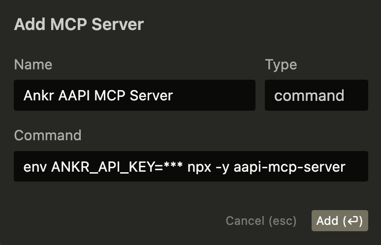

# Ankr Advanced API MCP Server ⚡

This is a Model Context Protocol ([MCP](https://modelcontextprotocol.io/)) server that provides tools for interacting with Ankr's Advanced APIs. It enables AI models to fetch blockchain data and perform various operations.

## Tools

- `getAccountBalance`: Fetch token balances across multiple blockchains for any address or ENS name
- `getTokenPrice`: Get current price for any token (native or ERC20) on supported blockchains

## Supported Blockchains

- **Mainnets:** Ethereum, BSC, Polygon, Arbitrum, Avalanche, Base, Fantom, Gnosis, Linea, Optimism, and more
- **Testnets:** Ethereum Sepolia, Ethereum Holesky, Base Sepolia, Avalanche Fuji, and others

## Setup

### Prerequisites

1. Ankr API Key
   - Create a free account at [ankr.com/rpc](http://ankr.com/rpc/)

### Configuring Cursor 🖥️

1. Open Cursor Settings
2. Navigate to Features > MCP Servers
3. Click on the "+ Add New MCP Server" button
4. Fill out the following information:
   - Name: Enter a nickname for the server (e.g., "Ankr AAPI MCP")
   - Type: Select "command" as the type
   - Command: `env ANKR_API_KEY=<YOUR_KEY> npx -y aapi-mcp-server`



### Use with Claude Desktop

```json
{
  "mcpServers": {
    "github": {
      "command": "npx",
      "args": ["-y", "aapi-mcp-server"],
      "env": {
        "ANKR_API_KEY": "<YOUR_KEY>"
      }
    }
  }
}
```

## Local development

Install dependencies

```sh
pnpm i
```

Run local SSE server

```sh
export ANKR_API_KEY="YOUR-ANKR-KEY"
pnpm dev:sse
```

## Hosted MCP Server

The hosted MCP server is a managed SSE endpoint that provides authenticated access over the internet.

### Endpoint

```
https://your-domain.com/{apiKey}/sse
```

### Authentication

- Replace `{apiKey}` with your key
- The server uses this key to authenticate requests to Ankr Advanced API
- Obtain your API key at [ankr.com/rpc](https://ankr.com/rpc)

### Example

```bash
# Connect to the SSE endpoint
curl -N https://your-domain.com/your-ankr-api-key/sse
```

The server validates your API key and establishes a persistent SSE connection for real-time blockchain data access.
